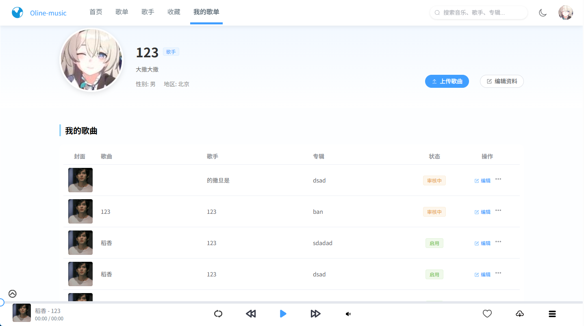
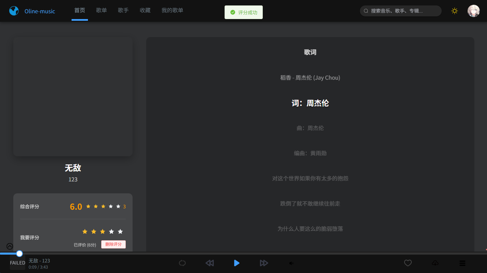
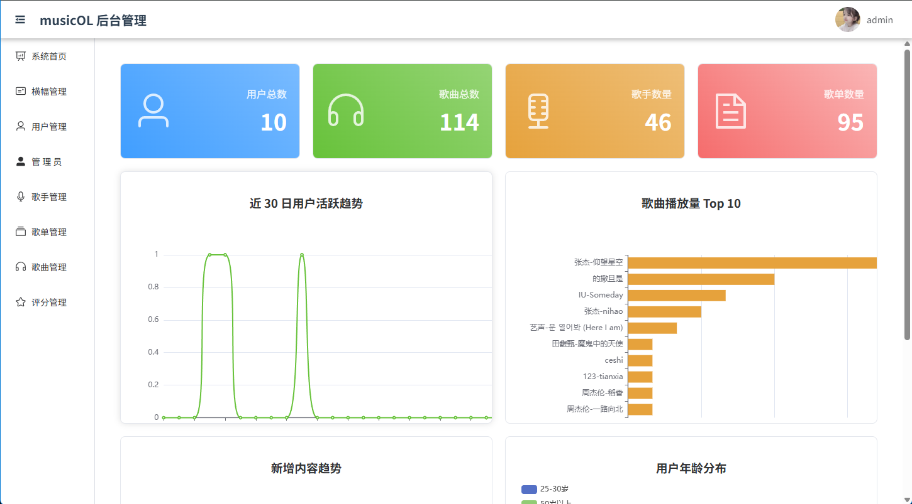
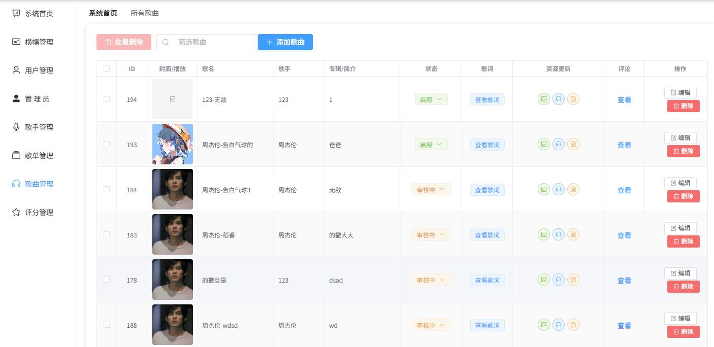

# ✨ 项目截图

## 首页


## 个人中心


## 歌曲界面（黑暗模式）


## 后台管理首页


## 歌曲管理


## 首页推荐

- 歌曲推荐通过基于用户的协同过滤算法
- 歌单评分的平均分排列
- 歌手创建时间的的排序

## 音乐系统

- 用户可以自己上传歌曲，歌单，管理自己的歌曲
- 最开始选择miniO,Redis,但后来选择了移除,所有资源直接通过本地磁盘获取
- 后台管理添加诸多功能，主要是歌曲，歌单的审核
- 优化了前端界面
- ~~部分~~代码写的不是很好


# 项目部署指南

## 环境要求

### 1. Java 环境
- **JDK 版本**: jdk-8u152 (Java 1.8)
- [下载地址](https://www.oracle.com/java/technologies/javase/javase8-archive-downloads.html)

### 2. Node.js 环境
- **Node.js 版本**: v22.13.0
- [下载地址](https://nodejs.org/download/release/v22.13.0/)

### 3. Maven 配置
- **Maven 版本**: apache-maven-3.9.9
- 配置阿里云镜像源（修改 `settings.xml`）:
  
### 3. IDE 版本
- **IDEA 版本**: IntelliJ IDEA 2025.3.3
- **VS Code 版本**: Visual Studio Code 1.110.1

```xml
<mirror>
  <id>aliyunmaven</id>
  <mirrorOf>*</mirrorOf>
  <name>阿里云公共仓库</name>
  <url>https://maven.aliyun.com/repository/public</url>
</mirror>
```

### 4. 数据库配置
- **MySQL 版本**: 5.7或8.0.46
- **Navicate版本**: 17
- [下载地址](https://dev.mysql.com/downloads/mysql/)
- SQL文件/music-server/music_system.sql

## 前端项目部署

### 清理并重新安装依赖
```bash
# 清理旧依赖
rm -rf node_modules
mv package-lock.json package-lock.json.bak

# 清理 npm 缓存
npm cache clean --force

# 使用淘宝镜像安装依赖
npm install --registry=https://registry.npmmirror.com
# 或使用：npm install --registry=https://registry.npm.taobao.org

# 启动开发服务器
npm run serve
```


## 后端项目部署

### 构建并运行
```bash
# 在 music-server 目录下
# 清理并打包
mvn clean
mvn package

# 运行项目
java -jar Music-0.0.1-SNAPSHOT.jar
```

## 快速部署脚本

### 前端项目构建
```bash
echo "开始部署前端项目..."

# 清理旧文件
rm -rf node_modules
mv package-lock.json package-lock.json.bak

# 安装依赖
npm cache clean --force
npm install --registry=https://registry.npmmirror.com

# 在 music-client 目录下（music-manage 同理）
npm run build

# 将构建结果移动到 nginx 目录（music-manage 同理）
mv /dist/* /nginx/html/client/

```

### 后端项目构建
```bash
# Maven 打包
mvn clean package -DskipTests

# 运行项目
java -jar target/Music-0.0.1-SNAPSHOT.jar

```

### nginx.conf配置文件
```yaml
worker_processes  1;

events {
    worker_connections  1024;
}

http {
    include       mime.types;
    default_type  application/octet-stream;

    sendfile        on;
    #tcp_nopush     on;

    #keepalive_timeout  0;
    keepalive_timeout  65;

    #gzip  on;

    server {
        listen       8080;
        server_name  localhost;
        location / {
            root   html/client;
            index  index.html;
           try_files $uri $uri/ /index.html;
        }
        error_page   500 502 503 504  /50x.html;
        location = /50x.html {
            root   html;
        }
    }
    server {
        listen       8081;
        server_name  localhost;
        location / {
            root   html/manage;
            index  index.html;
            try_files $uri $uri/ /index.html;
        }
        error_page   500 502 503 504  /50x.html;
        location = /50x.html {
            root   html;
        }

    }

}

```

## 数据库配置

### 创建用户并授权
```sql
-- 创建新用户（使用 mysql_native_password 插件）
CREATE USER 'root'@'%' IDENTIFIED WITH 'mysql_native_password' BY '123456';

-- 授予权限
GRANT ALL PRIVILEGES ON *.* TO 'root'@'%' WITH GRANT OPTION;

-- 刷新权限
FLUSH PRIVILEGES;

-- 检查现有用户
SELECT Host, User FROM mysql.user;
```

> **注意**: 允许所有 IP 访问在生产环境中不推荐，请根据实际情况配置。

## 注意事项

1. **版本一致性**: 请确保所有环境版本与要求一致
2. **权限配置**: 数据库权限配置需根据实际网络环境调整
3. **镜像源**: 国内用户建议使用阿里云或淘宝镜像加速下载


# music-recommendation-system
